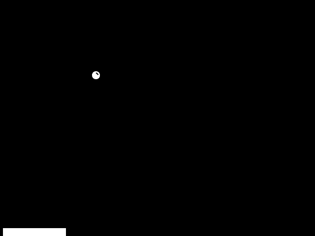

# Introduction to Realtime Programming

## Purpose
Lab 9 is designed to give you some exposure to:
1. Realtime programming and design,
2. Reading and understanding foreign APIs, and
3. Reading and understanding the code of others.

Lab 9 is to be completed individually since a large portion of it is a reading activity.
Lab 9 is also __due at the end of lab__.

## Realtime Programming
Up until now, we have created programs which have a defined starting point and ending point.
Interactive programs (e.g. desktop programs, smartphone apps, interactive websites, etc.) do not follow this model.
Instead, these applications run for as long as they are needed, and respond to dynamic inputs from a user.

Any Graphical User Interface (GUI) requires some form of realtime design.
This is because at any time you could select and modify the program's fields.
A good example of this is a game: at any time you have the ability to add an input into the system, and your inputs determine what the results of the game are.

The following diagram illustrates the basic idea.

## Tom's Pong

1. For lab 9, we will be working with a 2-Player version of Pong called Tom's Pong.
   Before you code anything, use `pip` to install the `pygame` module to your environment.
   This will be the same process as installing NumPy and matplotlib.
   If you need a refresher or guide, you can use the following __[setup guide](docs/numpy_matplotlib_installation.md)__.
   > Replace the matplotlib and NumPy modules with PyGame.

2. Before you start trying to code, read and work through the __[PyGame Development Tutorial](https://www.pygame.org/docs/tut/MakeGames.html)__ to understand what each part of the Tom's Pong code is doing.
   You only need to go through Sections 1-6.
   > I will manually check everyone off, and I WILL ask questions about the tutorial.
   Part of your grade depends on going through this tutorial.
   You should skim the majority of this tutorial, but make sure that you understand what each new section is adding to the game, and why this code is needed.

3. Once you have completed the PyGame tutorial, you should have a basic understanding of the components of Tom's Pong (in terms of the realtime programming diagram above).
   Now we will attempt to run Tom's Pong.
   The base Tom's Pong game has been provided in the `src/toms_pong.py` module.
   > __NOTE:__ This base game is publicly available in the provided tutorial, however, the code on their website contains pieces of code that are not friendly with Python 3.
   Due to this we have modified the source to make it compatible with the Python versions on the lab machines and your personal machines.
   This code should run out of the box, if you are having trouble getting the code to run, spend at least 5 minutes trying to debug on your own.
   If you still cannot get the code to launch, ask your instructor for help.
   
   > __NOTE:__ The tutorial uses the term bat to refer to the object which deflects the ball, this lab will refer to this object as a "paddle" due to the context of Brickout.
   These objects are the same, just be aware of the naming difference.

4. Now that we have the game running we can get to the fun part, modifying the game for our purposes.
   Labs 10-13 will involve re-creating the classic Atari game [Breakout](https://en.wikipedia.org/wiki/Breakout_(video_game)).
   Yes, the same breakout that was developed with Steve Wozniak and Steve Jobs!
   
   > A really cool side note, Google has an easter egg in their image search which mimics breakout, but with the images in your search query instead of Bricks!
   
   Let's take a look at Tom's Pong and breakout, we will notice that they have a lot in common.
   Both games have a paddle, a ball, and the ball bounces on the sides of screen.
   The code we just got running is already fairly close to what we're aiming for!
   
   
   
   Your final objective of this lab is to turn Tom's Pong into a primitive version of Breakout.
   In order to do this, make the following changes to the code.
   1. Remove the Player 2 (Right paddle).
   2. Remove the event code for player 2.
   3. Change the paddle location from the left side of the screen to the bottom of the screen.
      > __HINT:__ The `Srite.Rect` object has an attribute called `midbottom` that you can use.
   4. Change the paddle slider to travel the horizontal distance of the screen instead of the vertical distance.
   5. Change the keyboard input from W/S to A/D or UP/DOWN to LEFT/RIGHT (depending on which side of the keyboard you are using). 
   6. Ensure that the paddle does not go off screen when moving horizontally.
   7. Change the image of the paddle to that of a vertical paddle to that of a horizontal paddle.
      > We have provided default assets in the `img` folder.
      Once you finish the lab, feel free to modify these images to make the game look prettier.
      
> Once you are finished, your game should look similar to the following.

   
# Submission
For this lab, you will submit work directly to your lab instructor.
When you have finished step 4 in Tom's Pong, please call your instructor over and they will ask you some questions based on the tutorial you read earlier.

Your instructor will mark off a sheet identical to the rubric below. You will be required to initial the submission sheet to claim academic credit for this lab.
This lab can only be performed in-class, no make up labs will be available without a documented excuse.

> __NOTE:__ During the last 15 minutes of lab, your instructor may begin grading labs.
  Make sure that you are working on the higher value items early.

# Rubric
Because lab 9 does not follow the normal flow of labs, your grade will be based on a modified rubric.
> __NOTE:__ The score is out of 100 points, the All indented categories show a specific breakdown to show where all points are coming from.

* 25 - Installation of PyGame to your Python environment.
* 20 - Run Tom's Pong for the first time.
  > Running the modified code is sufficient, you do not need to show this to your instructor as well.
* 30 - Modify Tom's Pong into a simple version of Breakout
  * 6 - Remove one of the game's paddles.
  * 2 - Remove the keyboard input code for one of the players.
  * 3 - Change the location of the paddle to the bottom of the screen.
  * 10 - Get the paddle to slide horizontally instead of vertically.
  * 4 - Change the keyboard input for the paddle from UP/DOWN to LEFT/RIGHT
  * 5 - Change the sprite image of the paddle to the horizontal paddle.
* 25 - Answer 2-3 questions given by your instructor about the code.
  * 6 - Question 1
  * 6 - Question 2
  * 13 - Question 3

# Additional Documentation

[Command Line Interfaces](docs/cli.md)

[Installing with pip](docs/numpy_matplotlib_installation.md)

[Instantiation Example](docs/car_example.md)

[PyGame Docs & API](https://www.pygame.org/docs/)
